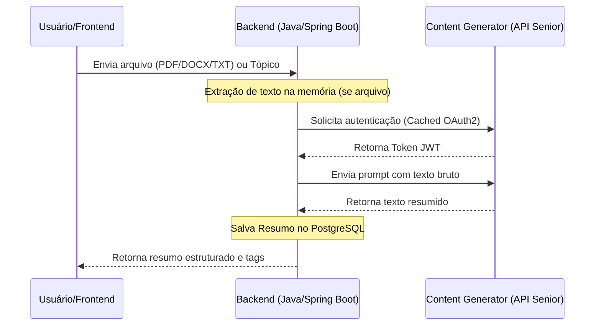
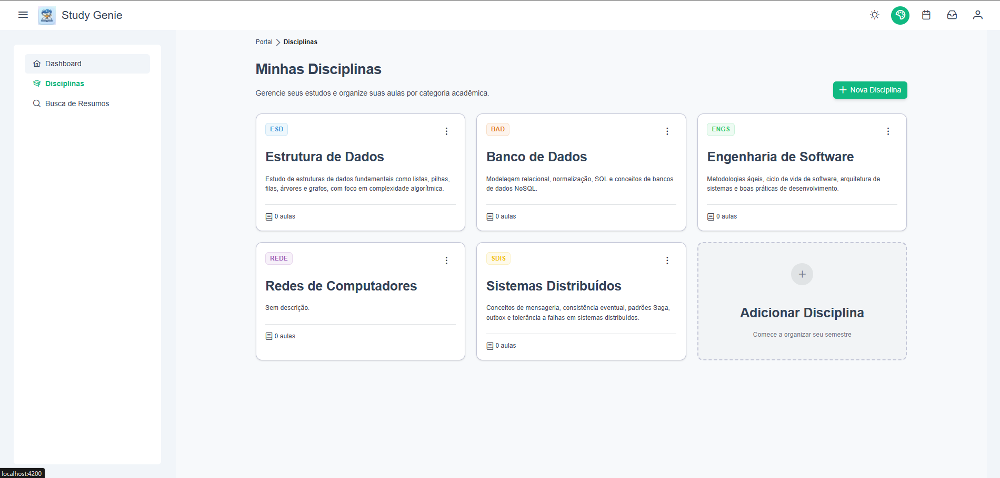
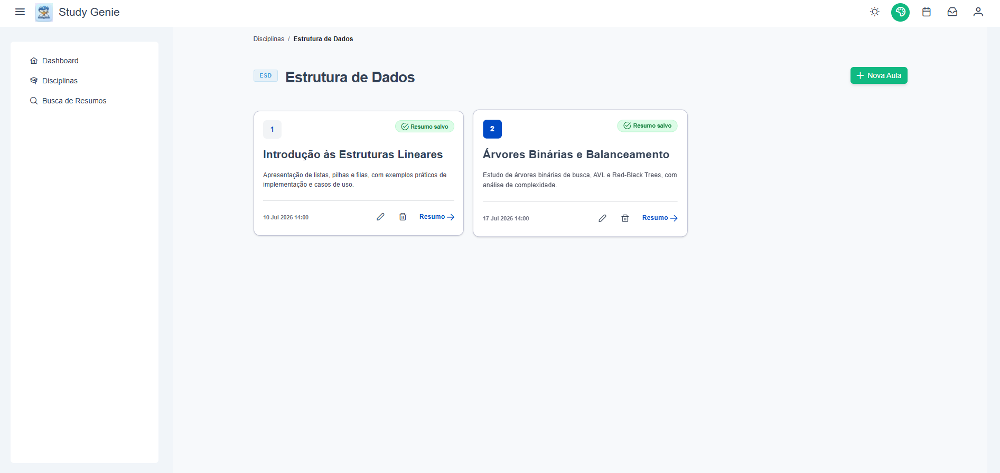
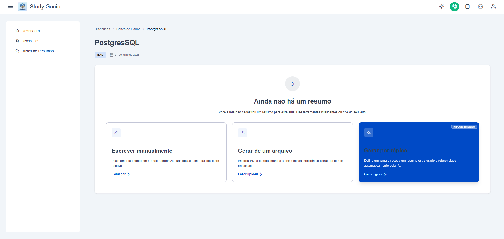
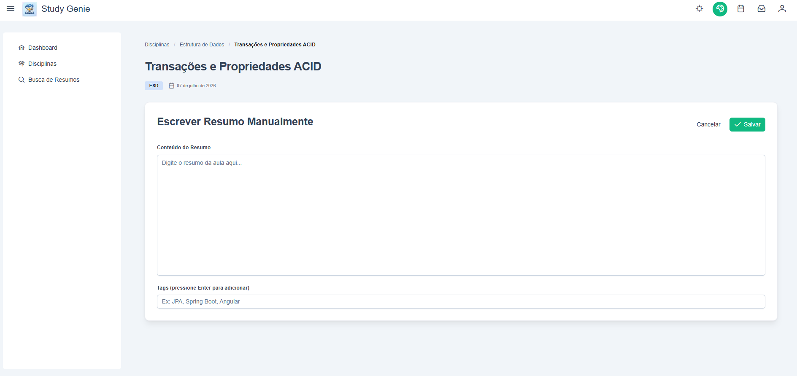
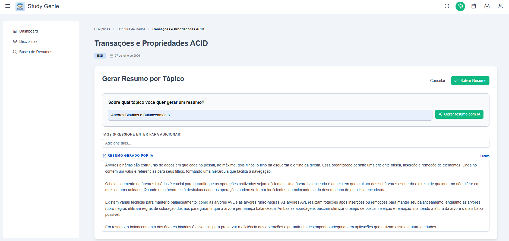
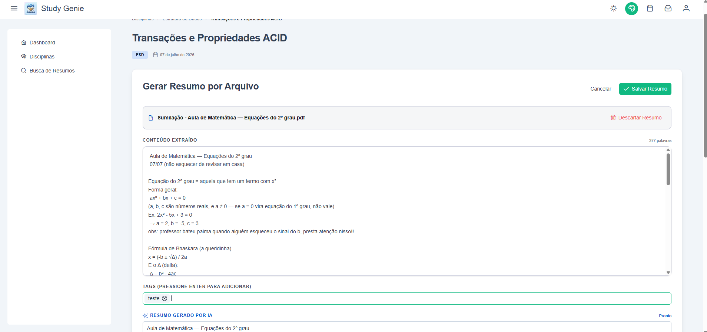
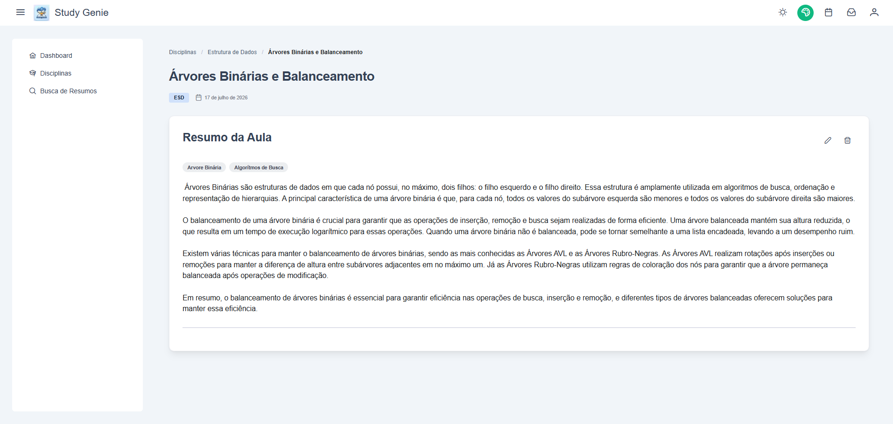
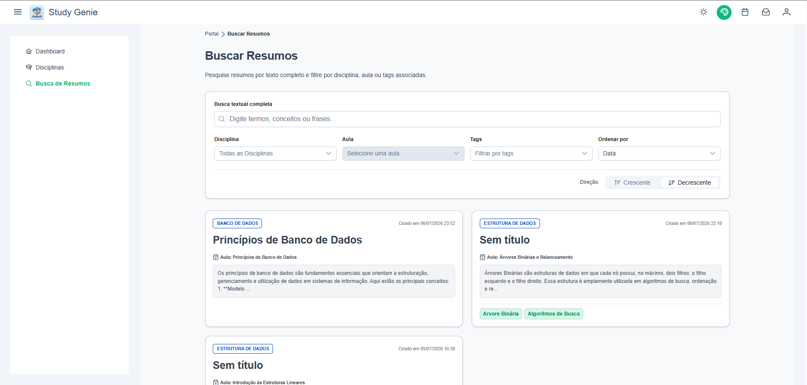

# Study Genie 🧞‍♂️✨

O **Study Genie** (Gênio dos Estudos) é uma aplicação FullStack projetada como um espaço inteligente de estudos. O nome remete a um assistente pessoal capaz de organizar disciplinas e aulas e, como num passe de mágica, gerar resumos estruturados com o auxílio de Inteligência Artificial.

A aplicação foi desenvolvida em conformidade com o desafio do **SeniorLabs**, utilizando a API externa do **Content Generator** da Senior para o processamento de LLM e IA generativa.

---

## 🤖 Diretrizes e Automação do Agente (`AGENTS.md`)

Este projeto foi construído em colaboração com um Agente de IA. Para garantir a consistência arquitetural do código, a padronização das APIs Rest em Java e a aderência aos padrões reativos modernos no frontend Angular, foi criado o arquivo de regras e padrões customizados em [.agents/AGENTS.md](.agents/AGENTS.md).

### Por que o `AGENTS.md` foi criado?
- **Padronização Estrita no Backend**: Forçar que todos os controladores Java residam no pacote `controller`, enquanto o restante das entidades (DTOs, Repositórios, Models) fiquem em pacotes específicos de domínio, além de garantir o uso de registros (`record`) para DTOs e UUIDs como chaves primárias.
- **Práticas Modernas no Frontend**: Assegurar a organização das funcionalidades em Feature Folders sob lazy-loading, o uso do PrimeNG como UI Kit principal e a implementação obrigatória de reatividade através de **Angular Signals** e injeções de dependência limpas via construtor.
- **Alinhamento do Agente**: Esse arquivo serve como uma "âncora de contexto" para que qualquer agente de desenvolvimento de IA trabalhando neste repositório siga exatamente as mesmas convenções e estilos pré-estabelecidos pelo projeto, mitigando retrabalho e desvios de padrão.

---

## 🏗️ Arquitetura da Solução

Para manter a segurança das credenciais, as requisições de Inteligência Artificial são centralizadas no backend. O fluxo de geração segue o seguinte modelo:



---

## 🛠️ Stack Tecnológica

### Backend (study-api-lesson)
- **Java 17** & **Spring Boot 4.0.7**
- **PostgreSQL 18**
- **Flyway 12.6.0** (Migrações de banco de dados)
- **Apache PDFBox 3.x / Apache POI** (Extração de texto em memória sem gravar no disco)
- **Cache de Token**: Cache resiliente implementado em [ContentGeneratorAuthService](apps/study-api-lesson/lesson/src/main/java/com/studygenie/lesson/contentgenerator/ContentGeneratorAuthService.java) através de `AtomicReference<String>`, invalidando o token e buscando um novo de forma transparente ao receber HTTP `401 Unauthorized` da API do Content Generator.

### Frontend (study-frontend)
- **Angular 19** com **Signals** (Gestão de estados reativa, limpa e performática)
- **PrimeNG 19** (UI Kit de alta fidelidade visual)
- **Tailwind CSS 4** & **PrimeIcons**

---

## 📖 Regras de Negócio Importantes

1. **Relação de Entidades**:
   - Uma **Disciplina** (`Course`) pode conter múltiplas **Aulas** (`Lesson`).
   - Cada **Aula** (`Lesson`) pode conter apenas um único **Resumo** (`Summary`) associado (1:1).
   - Um **Resumo** (`Summary`) pode ter múltiplas **Tags** para facilitar a busca e correlação, e uma **Tag** pode estar presente em vários resumos (N:N).
2. **Classificação da Origem (`source`)**:
   - Todo resumo criado armazena sua origem com um dos valores: `MANUAL`, `TOPIC` (Geração por tema com IA) ou `UPLOADED_FILE` (Geração por arquivo com IA).
3. **Persistência de Tags**:
   - Ao salvar um resumo, as tags informadas são criadas se não existirem, ou reaproveitadas do banco, evitando duplicidade de nomes.

---

## 🖥️ Funcionalidades & Fluxos

- 🔑 **Autenticação**: Controle de login básico no frontend com usuário estático (`admin@teste.com` / `Teste@123`).
- 📁 **CRUD de Disciplinas**: Cadastro com cores em formato HEX para identificação visual rápida na interface.
- 📓 **CRUD de Aulas**: Agendamento e gerenciamento de aulas associadas a cada disciplina.
- 📄 **Detalhamento da Aula & Resumos**: Visualização completa de uma aula selecionada, permitindo os seguintes fluxos de criação de resumos:
  1. **Resumo Manual**: O próprio usuário digita o título, tags e o conteúdo detalhado da matéria estudada.
  2. **Resumo por Tema/Tópico (IA)**: O usuário informa um assunto que deseja estudar (ex: *"Segunda Guerra Mundial"*) e o assistente cria um resumo estruturado automaticamente.
  3. **Resumo por Arquivo (IA)**: Upload de arquivos nos formatos **PDF**, **DOCX** ou **TXT**. O backend extrai o texto puro e o expõe em um painel de visualização prévia (preview). Após conferência, o usuário solicita a geração e a IA condensa o documento longo em tópicos formatados e sugere tags.
- 🔍 **Busca de Resumos**: Motor de busca integrado que realiza varreduras indexadas nos títulos e corpos textuais dos resumos. Permite filtros por disciplina, aula e tags específicas, além de ordenação por data, relevância e tamanho.

---

## 📸 Demonstração da Aplicação

Veja abaixo as telas principais do sistema Study Genie:

### 🗂️ Disciplinas e Temas
Lista principal contendo as disciplinas cadastradas com suas cores de identificação.


### 📓 Visualização das Aulas
Lista de aulas agendadas associadas a uma disciplina selecionada.


### 📄 Detalhes da Aula (Sem Resumo)
Visão inicial da aula antes do cadastro de resumo, oferecendo as opções de criação manual ou por IA.


### ✍️ Cadastro de Resumo Manual
Formulário de preenchimento manual do resumo da aula e tags.


### 🤖 Gerar Resumo por Tópico (IA)
Geração inteligente e instantânea de resumos a partir de um tema digitado.


### 📁 Gerar Resumo por Arquivo (IA)
Upload de arquivo PDF/DOCX/TXT com visualização prévia do conteúdo extraído antes de gerar o resumo.


### 📖 Detalhe da Aula com Resumo
Visualização final do resumo gerado com tópicos estruturados e tags associadas.


### 🔍 Busca de Resumos
Painel de busca avançada por texto, filtros por disciplina/aula/tags e ordenação dos resultados.



---

## 📁 Modelo de Banco de Dados

Baseado no [DATABASE_SCHEMA.md](docs/api-lesson/DATABASE_SCHEMA.md), as tabelas principais são estruturadas com chaves primárias em formato `UUID` gerados automaticamente:

```text
  ┌───────────┐         ┌───────────┐         ┌───────────┐
  │  COURSES  │1 ──── N │  LESSONS  │1 ──── 1 │ SUMMARIES │
  └───────────┘         └───────────┘         └─────┬─────┘
                                                    │ N
                                                    │
                                               ┌────┴────┐
                                               │  TAGS   │
                                               └─────────┘
```

---

## 🚀 Como Iniciar Localmente

### Pré-requisitos
- **Java 17**
- **Docker**
- **Node.js v24.x** & **pnpm** (para executar o front nativo)

> [!NOTE]
> Para obter instruções detalhadas e específicas de cada ambiente, consulte os respectivos READMEs do [Backend (study-api-lesson)](https://github.com/JesseRafaelDasNeves/study-api-lesson) e do [Frontend (study-frontend)](https://github.com/JesseRafaelDasNeves/study-frontend).

---

### Passo 1: Executando o Banco de Dados (Docker)
Na pasta `/apps/study-api-lesson/`, inicie o serviço do PostgreSQL 18:
```bash
docker compose up -d
```

### Passo 2: Executando a API REST (Spring Boot)
1. Crie um arquivo `.env` na raiz de `/apps/study-api-lesson/` contendo as variáveis baseadas no `.env.example`.
2. Para executar via terminal (PowerShell) fornecendo os dados e apontando para a JDK correta, utilize o script:

```powershell
${env:POSTGRES_LESSON_DB}='lesson'; ${env:POSTGRES_LESSON_USER}='api-study-leasson'; ${env:POSTGRES_LESSON_PASSWORD}='123456'; ${env:CONTENT_GENERATOR_ACCESS_KEY}='sua-chave'; ${env:CONTENT_GENERATOR_SECRET}='seu-secret'; ${env:CONTENT_GENERATOR_TENANT_NAME}='seu-tenant'; & 'C:\Program Files\Eclipse Adoptium\jdk-17.0.18.8-hotspot\bin\java.exe' '@C:\Users\jesse\AppData\Local\Temp\cp_43ii4q9iwi8zg1ae6yynxt14p.argfile' 'com.studygenie.lesson.LessonApplication'
```

*A API estará ativa em `http://localhost:8080` e o Swagger documentado em http://localhost:8080/swagger-ui/index.html.*

---

### Passo 3: Executando a Interface Web (Angular)
1. Navegue até a pasta `/apps/study-frontend/`.
2. Instale as dependências:
   ```bash
   pnpm install
   ```
3. Configure a URL de integração nos arquivos de ambiente:
   - Para modo Dev: [environment.development.ts](apps/study-frontend/src/environments/environment.development.ts)
   - Para modo Prod: [environment.ts](apps/study-frontend/src/environments/environment.ts)
4. Execute o servidor de desenvolvimento:
   ```bash
   pnpm start:dev
   ```

*O sistema estará disponível em http://localhost:4200 com acesso padrão do usuário:*
- **Usuário**: `admin@teste.com`
- **Senha**: `Teste@123`