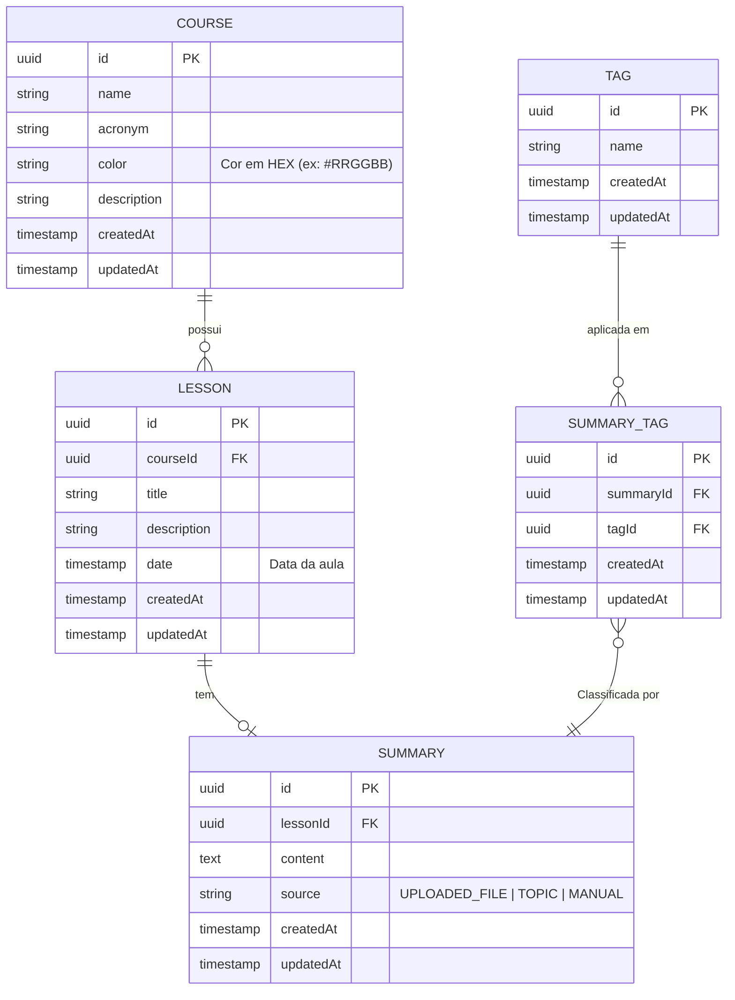

# Database Schema - Content Generator Study App

## Descrição do Diagrama

O diagrama de entidade e relacionamento (ER) apresenta a estrutura de dados para a aplicação de geração de resumos inteligentes de aulas. As entidades foram modeladas para suportar:

- **Organização hierárquica**: Disciplinas contêm Aulas, que contêm Resumos
- **Categorização de conteúdo**: Tags para palavras-chave e classificação dos resumos
- **Rastreabilidade**: Registro de datas de criação para auditoria
- **Identificação única**: Todos os registros utilizam UUID como chave primária

### Relacionamentos principais:

1. **Course ↔ Lesson**: Uma disciplina pode ter várias aulas (1:N)
2. **Lesson ↔ Summary**: Uma aula pode ter um resumo (1:1, com possibilidade de expansão futura)
3. **Summary ↔ Tag**: Um resumo pode ter múltiplas tags e uma tag pode estar em múltiplos resumos (N:N através de SummaryTag)

### Campos incluídos:

- **Identificadores**: `id` (uuid) para todas as entidades
- **Relacionamentos**: Chaves estrangeiras para manter integridade referencial
- **Conteúdo**: Campos essenciais (título, descrição, conteúdo)
- **Metadados**: `createdAt` e `updatedAt` para auditoria
- **Tipo de origem**: `source` no Summary para rastrear se foi gerado via arquivo, tópico ou manual

---

## Diagrama ER (Mermaid)

---

## Detalhamento das Entidades

### **Course (Disciplina)**
| Campo | Tipo | Descrição |
|-------|------|-----------|
| `id` | UUID | Identificador único |
| `name` | String | Obrigatório, único, tamanho entre 3 e 100 caracteres |
| `acronym` | String | Obrigatório, único, tamanho entre 3 e 4 caracteres |
| `color` | String | Obrigatório, tamanho entre 4 e 10 caracteres (ex.: `#RRGGBB`) |
| `description` | Text | Opcional |
| `createdAt` | Timestamp | Opcional |
| `updatedAt` | Timestamp | Opcional |

### **Lesson (Aula)**
| Campo | Tipo | Descrição |
|-------|------|-----------|
| `id` | UUID | Identificador único |
| `courseId` | UUID (FK) | Obrigatório |
| `title` | String | Obrigatório, tamanho entre 3 e 100 caracteres |
| `description` | Text | Opcional |
| `date` | Timestamp | Obrigatório |
| `createdAt` | Timestamp | Opcional |
| `updatedAt` | Timestamp | Opcional |

### **Summary (Resumo)**
| Campo | Tipo | Descrição |
|-------|------|-----------|
| `id` | UUID | Identificador único |
| `lessonId` | UUID (FK) | Obrigatório |
| `content` | Text | Obrigatório |
| `source` | Enum | Obrigatório (valores: `UPLOADED_FILE`, `TOPIC`, `MANUAL`) |
| `createdAt` | Timestamp | Opcional |
| `updatedAt` | Timestamp | Opcional |

### **Tag**
| Campo | Tipo | Descrição |
|-------|------|-----------|
| `id` | UUID | Identificador único |
| `name` | String | Obrigatório, único, tamanho entre 3 e 20 caracteres |
| `createdAt` | Timestamp | Opcional |
| `updatedAt` | Timestamp | Opcional |

### **SummaryTag (Tabela de Junção)**
| Campo | Tipo | Descrição |
|-------|------|-----------|
| `id` | UUID | Identificador único |
| `summaryId` | UUID (FK) | Obrigatório |
| `tagId` | UUID (FK) | Obrigatório |
| `createdAt` | Timestamp | Opcional |
| `updatedAt` | Timestamp | Opcional |
